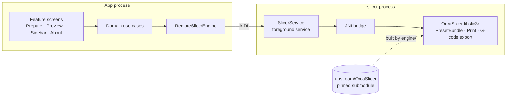

<div align="center">


# Orcinus

**The OrcaSlicer engine on your Android phone.**

Slice 3D models into G-code right on the device: no computer, no cloud.

[](LICENSE)
[](https://github.com/OrcaSlicer/OrcaSlicer/releases/tag/v2.4.2)


**English** · [Русский](README.ru.md)

</div>

---

Orcinus does not reimplement a slicer. It builds **OrcaSlicer's own `libslic3r`**,
its dependencies, and its printer profiles for Android, straight from the
upstream sources, so a model sliced on the phone gives the G-code desktop
OrcaSlicer would.

## Highlights

|  |  |
| --- | --- |
| 🧩 **The real engine** | OrcaSlicer 2.4.2 compiled for `arm64-v8a` from its unmodified sources and dependency recipes. Its own test suites pass on a Pixel 8 Pro. |
| 🎯 **Desktop parity** | G-code from the phone is compared with official OrcaSlicer 2.4.2: 10 models, same layers and settings, extrusion within 1 %. [Details](docs/golden-comparison.md) |
| ⚡ **Slices in the background** | The engine runs in its own process as a foreground service: progress and a cancel button in a notification, and a native crash never takes the app down. |
| 🎨 **Feels like OrcaSlicer** | OrcaSlicer's colours, icons, and workspace layout, light and dark, with an adaptive layout for phones and wider screens. |
| 🔒 **Private by design** | Works fully offline. No internet permission, no analytics, no accounts. |
| 🆓 **Free software** | GNU AGPL v3.0, like OrcaSlicer. Every bundled component and its license is listed in the app. |

## Roadmap

Orcinus is an early preview: it slices, but it is not yet a full slicer app.

- [x] OrcaSlicer engine and its dependencies built for Android; upstream tests pass on a device
- [x] Import STL models, or add a 20 mm calibration cube
- [x] Slicing in the background with progress and cancellation
- [x] G-code verified against desktop OrcaSlicer
- [x] OrcaSlicer-style workspace, themes, and the About page with licenses
- [ ] 3D plate view
- [ ] G-code preview with OrcaSlicer's `libvgcode`
- [ ] Printer, filament, and process selection (the preview ships Creality K2 Plus profiles)
- [ ] Settings editor, 3MF and STEP, sending jobs to printers
- [ ] English interface (the preview is in Russian)
- [ ] Google Play release

## How it works



- **Upstream stays untouched.** OrcaSlicer is a pinned Git submodule. `engine/`
  reads its source lists and dependency recipes, so updating OrcaSlicer means
  moving the submodule and rebuilding, not porting code.
- **Clean architecture.** Every screen is its own feature module on top of
  domain use cases and an OrcaSlicer-based design system; the engine is reached
  only through a port. See [`docs/architecture.md`](docs/architecture.md).

| Path | What is there |
| --- | --- |
| [`app/`](app) | Composition root, navigation, the `:slicer` service |
| [`feature/`](feature) | Screens: Prepare, Preview, Sidebar, About |
| [`core/designsystem/`](core/designsystem) | OrcaSlicer's colours, type, icons, and components in Compose |
| [`domain/`](domain), [`data/`](data) | Use cases and repositories |
| [`slicing/`](slicing) | Engine port, AIDL service, JNI adapter |
| [`engine/`](engine) | Android build of OrcaSlicer and its dependencies |
| [`upstream/`](upstream) | The pinned OrcaSlicer submodule |
| [`scripts/`](scripts) | Engine build, device tests, desktop comparison, license notices |
| [`docs/`](docs) | Architecture, work plan, publishing (mostly in Russian) |

## Building

**You need:** Android Studio (its JDK), Android SDK with NDK 28.2.13676358,
CMake 3.25+ and Ninja on `PATH`, Python 3, and an `arm64` Android device.
The first build of the dependencies takes about an hour.

```sh
git clone --recurse-submodules https://github.com/ArtLoz/-Orcinus.git
cd ./-Orcinus
```

Create `local.properties` with `sdk.dir=<path to the Android SDK>`, then:

```powershell
# OrcaSlicer's dependencies for Android, once
powershell -NoProfile -ExecutionPolicy Bypass -File ./scripts/engine.ps1 -Stage deps

# The app; Gradle builds liborcinus_engine.so together with libslic3r
./gradlew.bat :app:assembleDebug
```

<details>
<summary><b>Run OrcaSlicer's tests on a device</b></summary>

```powershell
powershell -NoProfile -ExecutionPolicy Bypass -File ./scripts/engine.ps1 -Stage all -Target libslic3r_tests,fff_print_tests
powershell -NoProfile -ExecutionPolicy Bypass -File ./scripts/engine-test.ps1 -Suite fff_print_tests
powershell -NoProfile -ExecutionPolicy Bypass -File ./scripts/engine-test.ps1 -Suite libslic3r_tests
```

See [`engine/README.md`](engine/README.md).
</details>

<details>
<summary><b>Compare with desktop OrcaSlicer</b></summary>

```powershell
powershell -NoProfile -ExecutionPolicy Bypass -File ./scripts/engine.ps1 -Stage engine -Target orca_engine_slice
powershell -NoProfile -ExecutionPolicy Bypass -File ./scripts/golden.ps1
```

The script downloads the official OrcaSlicer 2.4.2 build (pinned by hash),
slices the same models on the desktop and on the phone, and compares the
G-code. See [`docs/golden-comparison.md`](docs/golden-comparison.md).
</details>

<details>
<summary><b>Build a release</b></summary>

Release builds are minified with R8 and signed with a key kept outside the
repository. See [`docs/publishing.md`](docs/publishing.md).

```powershell
./gradlew.bat :app:bundleRelease
```
</details>

## Contributing

Issues and pull requests are welcome, in English or Russian. Start with
[`CONTRIBUTING.md`](CONTRIBUTING.md).

## License

Orcinus is free software under the [GNU Affero General Public License v3.0](LICENSE),
the license of OrcaSlicer, whose engine, profiles, and icons it includes.

Bundled libraries keep their own licenses; the About page in the app lists
every component with its full license text. The interface font is
[Inter](https://rsms.me/inter/) (SIL Open Font License 1.1).

## Acknowledgements

Orcinus stands on the work of [OrcaSlicer](https://github.com/OrcaSlicer/OrcaSlicer)
by SoftFever and contributors, which builds on
[Bambu Studio](https://github.com/bambulab/BambuStudio) by Bambu Lab,
[PrusaSlicer](https://github.com/prusa3d/PrusaSlicer) by Prusa Research, and
Slic3r by Alessandro Ranellucci and the RepRap community.

<sub>Orcinus is an independent project. It is not affiliated with or endorsed by the developers of OrcaSlicer, Bambu Studio, or PrusaSlicer.</sub>
