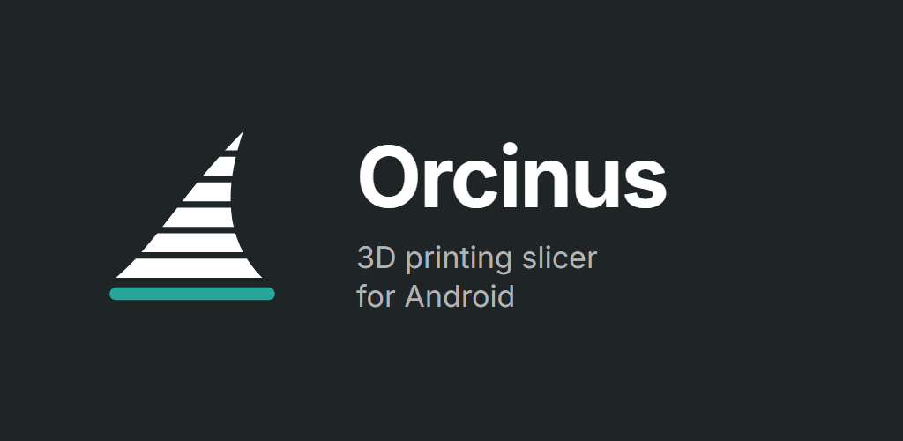
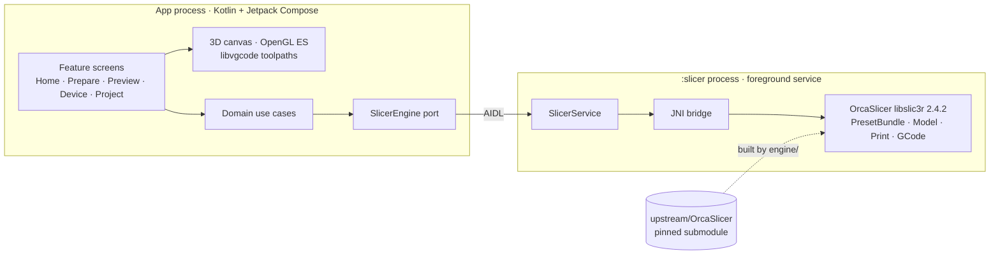

<div align="center">



### The complete OrcaSlicer engine, running natively on Android.

Prepare, slice, and send 3D prints from your phone or tablet.<br>
No computer, no cloud, and the same G-code as desktop OrcaSlicer.

[](LICENSE)
[](https://github.com/OrcaSlicer/OrcaSlicer/releases/tag/v2.4.2)


**English** · [Русский](README.ru.md)

[Features](#features) · [How it works](#how-it-works) · [Verification](#verified-against-desktop-orcaslicer) · [Building](#building-from-source) · [Contributing](#contributing)

</div>

---

## Overview

Orcinus is a full 3D-printing slicer for Android. Instead of reimplementing a
slicer or sending your models to a server, it compiles **OrcaSlicer's own C++
engine** (`libslic3r`, its 17 dependencies, and the system profiles of all 66
printer vendors) for Android, and drives it from a touch-first interface.

Every slicing decision comes from the OrcaSlicer code. A model sliced on the
phone produces the G-code that desktop OrcaSlicer 2.4.2 produces with the same
profiles, and an automated comparison checks this on every engine change.

> [!NOTE]
> **Status: pre-release (0.1.0).** OrcaSlicer 2.4.2's FFF workflow is ported
> and verified on a device. The app is not yet published on Google Play; build
> it from source as described [below](#building-from-source).

## Features

### Prepare
- **Multi-plate workspace** with OrcaSlicer's 3D view: realistic shading with
  shadows and ambient occlusion, a view cube, object labels, overhang
  highlighting, and sequential-print clearances.
- **Open almost anything:** STL, OBJ with colours, 3MF projects, STEP, AMF,
  SVG, and ZIP archives, from the file picker, from *Open with* and *Share*,
  or by drag and drop. OrcaSlicer's handy models and test models are built in.
- **Object tools:** move, rotate, scale, lay on face, auto-orient, arrange and
  fill the bed, cut with connectors, mesh booleans, text and SVG embossing,
  measure, brim ears, assembly view, simplify, and repair.
- **Painting:** supports, seams, fuzzy skin, and multi-material colours.
- **Per-object control:** an object list with parts, modifiers, height ranges,
  and copies; per-object and per-plate settings; variable layer height; and
  OrcaSlicer's Parameter Table for every object's key settings at once.

### Slice and preview
- **Background slicing** in a separate process, with progress and Cancel in a
  notification. A crash inside the engine never takes the app down.
- **G-code preview** on OrcaSlicer's own `libvgcode`: layer and move sliders,
  16 legend views (line type, speed, flow, layer time, temperature, pressure
  advance, and more), the G-code window, and the tool position.
- **Warnings that help:** OrcaSlicer's slicing warnings and errors, each with
  *Jump to* the object or setting at fault.
- **Output:** save G-code or a sliced `.gcode.3mf`, export toolpaths as OBJ,
  share through Android, or open any existing `.gcode` and `.gcode.3mf`.

### Printers, filaments, and settings
- **OrcaSlicer's setup wizard** with the profiles of all 66 vendors, plus
  online profile updates (can be turned off).
- **The complete settings tabs** for printer, filament, and process: every
  page and option, with OrcaSlicer's validation, search, preset comparison,
  and the questions it asks before discarding or transferring changes.
- **Multi-material:** filament slots, flushing volumes, wipe tower, and
  ramming.
- **Calibration:** temperature, flow ratio, pressure advance, retraction,
  max flow rate, VFA, input shaping, and cornering.

### Print
- **Send to 16 kinds of printer hosts:** OctoPrint/Klipper, Moonraker,
  PrusaLink, PrusaConnect, Duet, FlashAir, AstroBox, Repetier, MKS, ESP3D,
  CrealityPrint (with CFS material mapping), Flashforge, Elegoo Link, Obico,
  SimplyPrint, and 3DPrinterOS.
- **Printer discovery** on the local network, and an upload queue that keeps
  running after you leave the screen.

### Everywhere
- **OrcaSlicer's 22 languages** (the app's own texts are in English and
  Russian), light and dark themes, and layouts for phones and tablets.
- **Projects:** autosave and recovery after a crash, recent projects, and
  OrcaSlicer's project info.
- **Private by design:** no accounts, analytics, or ads. Orcinus goes online
  only to check for profile updates (can be turned off), to reach the printers
  you add, and to run the network test when you start it.

## How it works


```mermaid
flowchart LR
    subgraph app["App process · Kotlin + Jetpack Compose"]
        direction TB
        ui["Feature screens<br/>Home · Prepare · Preview · Device · Project"]
        render["3D canvas · OpenGL ES<br/>libvgcode toolpaths"]
        domain["Domain use cases"]
        port["SlicerEngine port"]
        ui --> domain
        ui --> render
        domain --> port
    end
    subgraph slicer[":slicer process · foreground service"]
        direction TB
        service["SlicerService"] --> jni["JNI bridge"]
        jni --> orca["OrcaSlicer libslic3r 2.4.2<br/>PresetBundle · Model · Print · GCode"]
    end
    port -- AIDL --> service
    upstream[("upstream/OrcaSlicer<br/>pinned submodule")] -. "built by engine/" .-> orca
```

- **Upstream stays untouched.** OrcaSlicer is a pinned Git submodule. The
  `engine/` build reads its source lists and dependency recipes, so updating
  OrcaSlicer means moving the submodule and rebuilding, not porting code. The
  only patch adapts `libvgcode` to OpenGL ES.
- **A faithful port.** The desktop app's behaviour (its dialogs, menus,
  validation, and edge cases) is ported function by function from
  OrcaSlicer's GUI code, and each port names the original it follows. Only the
  presentation changes, to touch-first mobile patterns.
- **Isolated engine.** `libslic3r` runs only in the `:slicer` process behind
  an AIDL service, so heavy slicing never blocks the interface and a native
  crash cannot close the app.
- **Clean architecture.** Screens are independent feature modules on top of
  domain use cases; the engine is reached only through a port. See
  [`docs/architecture.md`](docs/architecture.md).

<details>
<summary><b>Repository layout</b></summary>

| Path | Contents |
| --- | --- |
| [`app/`](app) | Application shell: dependency wiring, navigation, the `:slicer` service |
| [`feature/`](feature) | Screens: `home`, `prepare`, `preview`, `device`, `project`, `sidebar`, `settings`, `setup`, `preferences`, `objecttable`, `about` |
| [`core/`](core) | `model` (pure Kotlin state), `designsystem` (OrcaSlicer's theme, icons, and components in Compose), `ui` (shared dialogs and menus) |
| [`domain/`](domain) | Use cases: the application logic ported from OrcaSlicer's GUI |
| [`data/`](data) | Plate state repository and third-party license notices |
| [`render/`](render) | `scene`: the 3D canvas; `gcode`: OrcaSlicer's `libvgcode` over JNI |
| [`slicing/`](slicing) | `api`: the engine port; `service`: the AIDL service; `native`: the JNI bridge and the C++ adapter over `libslic3r` |
| [`network/`](network) | Print host clients and printer discovery |
| [`storage/`](storage) | Projects, documents, and scene files on Android storage |
| [`engine/`](engine) | CMake build of OrcaSlicer and its dependencies for Android arm64 |
| [`upstream/`](upstream) | OrcaSlicer, pinned in [`orca.lock.json`](upstream/orca.lock.json) |
| [`scripts/`](scripts) | Engine build, device tests, desktop comparison, license notices |
| [`docs/`](docs) | Architecture, slicing contract, work plan, publishing (mostly in Russian) |

</details>

## Verified against desktop OrcaSlicer

Every capability is reported at one of three levels: **C**, it compiles;
**R**, it runs and passes checks on a real device; **G**, its result matches
desktop OrcaSlicer. The engine is held to G.

| Check | Latest result on a Pixel 8 Pro |
| --- | --- |
| OrcaSlicer's own `fff_print_tests` | 37 of 37 test cases |
| OrcaSlicer's own `libslic3r_tests` | 114 test cases, 48,537 assertions |
| App ↔ engine integration (`orca_engine_adapter_tests`) | 154 test cases, 5,296 assertions |
| G-code vs. the official OrcaSlicer 2.4.2 build | 10 reference models: the same layers, filament within 0.03 %, print time within ±2 s |

The comparison downloads the official desktop release (pinned by hash),
slices the same models with the same profiles on the desktop and on the phone,
and compares the G-code move by move. See
[`docs/golden-comparison.md`](docs/golden-comparison.md).

## Building from source

### Requirements

- Windows 10 or 11: the build scripts use PowerShell, and the engine build
  fetches MSYS2 for GMP and MPFR on its own
- Android Studio, with `JAVA_HOME` pointing to its bundled JDK (`jbr`), and
  the Android SDK with NDK **28.2.13676358**
- CMake 3.25+ and Ninja on `PATH`, and Python 3
- An arm64 device with Android 10 or newer

### Build and install

Open the project once in Android Studio, which writes `local.properties` with
the SDK path, or create the file yourself with `sdk.dir=C:/path/to/Android/Sdk`.

```powershell
git clone --recurse-submodules https://github.com/ArtLoz/-Orcinus.git
cd ./-Orcinus

# OrcaSlicer's dependencies for Android: once, about an hour
powershell -NoProfile -ExecutionPolicy Bypass -File ./scripts/engine.ps1 -Stage deps

# The app; Gradle builds the engine library together with libslic3r
./gradlew.bat :app:assembleDebug
adb install -r app/build/outputs/apk/debug/app-debug.apk
```

<details>
<summary><b>Run the tests</b></summary>

```powershell
# Unit tests of the app's logic, UI, and network layers
./gradlew.bat :domain:test :core:ui:testDebugUnitTest :feature:sidebar:testDebugUnitTest :network:printhost:test

# OrcaSlicer's suites and the integration suite on a connected device
powershell -NoProfile -ExecutionPolicy Bypass -File ./scripts/engine.ps1 -Stage all -Target libslic3r_tests,fff_print_tests,orca_engine_adapter_tests
powershell -NoProfile -ExecutionPolicy Bypass -File ./scripts/engine-test.ps1 -Suite fff_print_tests
powershell -NoProfile -ExecutionPolicy Bypass -File ./scripts/engine-test.ps1 -Suite orca_engine_adapter_tests

# G-code comparison with desktop OrcaSlicer
powershell -NoProfile -ExecutionPolicy Bypass -File ./scripts/engine.ps1 -Stage engine -Target orca_engine_slice
powershell -NoProfile -ExecutionPolicy Bypass -File ./scripts/golden.ps1
```

More in [`engine/README.md`](engine/README.md).
</details>

<details>
<summary><b>Update OrcaSlicer</b></summary>

```powershell
powershell -NoProfile -ExecutionPolicy Bypass -File ./scripts/update-orca.ps1 -Ref v2.4.3
powershell -NoProfile -ExecutionPolicy Bypass -File ./scripts/engine.ps1 -Stage all -Target libslic3r_tests,fff_print_tests,orca_engine_adapter_tests
./gradlew.bat :domain:test :app:assembleDebug
python scripts/notices/update_notices.py
```

Then run the device suites and the desktop comparison. The rules are in
[`docs/upstream.md`](docs/upstream.md).
</details>

<details>
<summary><b>Build a release</b></summary>

Release builds are minified with R8 and signed with a key kept outside the
repository. See [`docs/publishing.md`](docs/publishing.md).

```powershell
./gradlew.bat :app:bundleRelease
```
</details>

## Not included

Some OrcaSlicer features depend on closed services or on a desktop and are
out of scope: Bambu Lab's cloud, device monitor, AMS, and dual-nozzle printers
(they need Bambu's closed network plug-in), Orca Cloud accounts and model
downloads, desktop window and mouse settings, file associations, and USD, ABC,
and PLY import (macOS-only in OrcaSlicer).

## Contributing

Issues and pull requests are welcome, in English or Russian. Start with
[`CONTRIBUTING.md`](CONTRIBUTING.md), and say in a pull request what you
verified on a device and what only compiles.

## License

Orcinus is free software under the [GNU Affero General Public License v3.0](LICENSE),
the license of OrcaSlicer, whose engine, profiles, and icons it includes.

Bundled libraries keep their own licenses; the About page in the app lists
every component with its full license text. The interface font is
[Inter](https://rsms.me/inter/) (SIL Open Font License 1.1).

## Acknowledgements

Orcinus stands on the work of [OrcaSlicer](https://github.com/OrcaSlicer/OrcaSlicer)
by SoftFever and contributors, which builds on
[Bambu Studio](https://github.com/bambulab/BambuStudio) by Bambu Lab,
[PrusaSlicer](https://github.com/prusa3d/PrusaSlicer) by Prusa Research, and
Slic3r by Alessandro Ranellucci and the RepRap community.

<sub>Orcinus is an independent project. It is not affiliated with or endorsed by the developers of OrcaSlicer, Bambu Studio, or PrusaSlicer.</sub>
