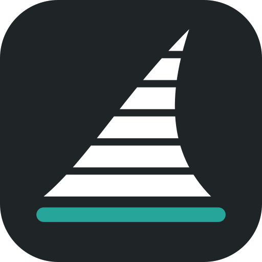
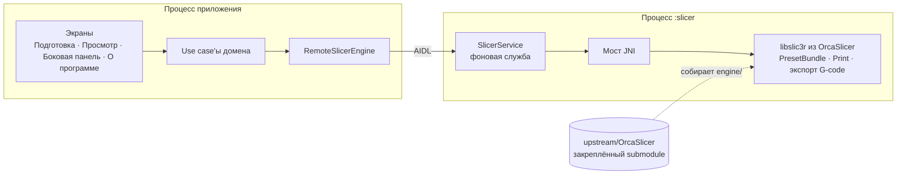

<div align="center">



# Orcinus

**Ядро OrcaSlicer — прямо на Android-телефоне.**

Нарезка 3D-моделей в G-code на самом устройстве: без компьютера и без облака.

[](LICENSE)
[](https://github.com/OrcaSlicer/OrcaSlicer/releases/tag/v2.4.2)


[English](README.md) · **Русский**

</div>

---

Orcinus не переписывает слайсер заново. Он собирает под Android **настоящий
`libslic3r` из OrcaSlicer**, его зависимости и профили принтеров прямо из
исходников Orca, поэтому модель, нарезанная на телефоне, даёт тот же G-code,
что и настольный OrcaSlicer.

## Возможности

|  |  |
| --- | --- |
| 🧩 **Настоящее ядро** | OrcaSlicer 2.4.2, собранный под `arm64-v8a` из неизменённых исходников и рецептов зависимостей. Его собственные тесты проходят на Pixel 8 Pro. |
| 🎯 **Как на компьютере** | G-code с телефона сравнивается с официальным OrcaSlicer 2.4.2: 10 моделей, те же слои и настройки, выдавливание расходится меньше чем на 1 %. [Подробнее](docs/golden-comparison.md) |
| ⚡ **Нарезка в фоне** | Ядро работает в отдельном процессе как фоновая служба: ход и кнопка отмены в уведомлении, а падение ядра не закрывает приложение. |
| 🎨 **Интерфейс как в OrcaSlicer** | Цвета, иконки и раскладка рабочего пространства OrcaSlicer, светлая и тёмная темы, адаптивная раскладка для телефонов и широких экранов. |
| 🔒 **Конфиденциальность** | Работает полностью без сети. Нет доступа в интернет, аналитики и учётных записей. |
| 🆓 **Свободное ПО** | GNU AGPL v3.0, как у OrcaSlicer. Все компоненты и их лицензии перечислены в приложении. |

## Дорожная карта

Orcinus — ранняя версия: нарезать уже умеет, но полноценным слайсером пока не
стал.

- [x] Ядро OrcaSlicer и его зависимости собраны под Android, тесты Orca проходят на устройстве
- [x] Импорт моделей STL и тестовый куб 20 мм
- [x] Нарезка в фоне с ходом выполнения и отменой
- [x] G-code проверен против настольного OrcaSlicer
- [x] Рабочее пространство в стиле OrcaSlicer, темы, страница «О программе» с лицензиями
- [ ] 3D-вид стола
- [ ] Просмотр G-code на `libvgcode` из OrcaSlicer
- [ ] Выбор принтера, материала и настроек (сейчас профили Creality K2 Plus)
- [ ] Редактор настроек, 3MF и STEP, отправка на принтер
- [ ] Английский интерфейс (сейчас только русский)
- [ ] Выпуск в Google Play

## Как устроено



- **OrcaSlicer не правится.** Orca подключена закреплённым Git submodule.
  `engine/` читает её списки исходников и рецепты зависимостей, поэтому
  обновление OrcaSlicer — это сдвинуть submodule и пересобрать, а не переносить
  код руками.
- **Чистая архитектура.** Каждый экран — отдельный feature-модуль поверх
  use case'ов домена и дизайн-системы в стиле OrcaSlicer; к ядру обращаются
  только через порт. Подробнее — [`docs/architecture.md`](docs/architecture.md).

| Путь | Что там |
| --- | --- |
| [`app/`](app) | Корень композиции, навигация, служба `:slicer` |
| [`feature/`](feature) | Экраны: подготовка, просмотр, боковая панель, «О программе» |
| [`core/designsystem/`](core/designsystem) | Цвета, шрифты, иконки и компоненты OrcaSlicer на Compose |
| [`domain/`](domain), [`data/`](data) | Use case'ы и репозитории |
| [`slicing/`](slicing) | Порт ядра, AIDL-служба, JNI-адаптер |
| [`engine/`](engine) | Сборка OrcaSlicer и её зависимостей под Android |
| [`upstream/`](upstream) | Закреплённый submodule OrcaSlicer |
| [`scripts/`](scripts) | Сборка ядра, тесты на устройстве, сравнение с desktop, лицензии |
| [`docs/`](docs) | Архитектура, рабочий план, публикация |

## Сборка

**Понадобятся:** Android Studio (её JDK), Android SDK с NDK 28.2.13676358,
CMake 3.25+ и Ninja в `PATH`, Python 3 и Android-устройство `arm64`.
Первая сборка зависимостей занимает около часа.

```sh
git clone --recurse-submodules https://github.com/ArtLoz/-Orcinus.git
cd ./-Orcinus
```

Создать `local.properties` со строкой `sdk.dir=<путь к Android SDK>`, затем:

```powershell
# Зависимости OrcaSlicer под Android, один раз
powershell -NoProfile -ExecutionPolicy Bypass -File ./scripts/engine.ps1 -Stage deps

# Приложение; Gradle сам собирает liborcinus_engine.so вместе с libslic3r
./gradlew.bat :app:assembleDebug
```

<details>
<summary><b>Тесты OrcaSlicer на устройстве</b></summary>

```powershell
powershell -NoProfile -ExecutionPolicy Bypass -File ./scripts/engine.ps1 -Stage all -Target libslic3r_tests,fff_print_tests
powershell -NoProfile -ExecutionPolicy Bypass -File ./scripts/engine-test.ps1 -Suite fff_print_tests
powershell -NoProfile -ExecutionPolicy Bypass -File ./scripts/engine-test.ps1 -Suite libslic3r_tests
```

Подробнее — [`engine/README.md`](engine/README.md).
</details>

<details>
<summary><b>Сравнение с настольным OrcaSlicer</b></summary>

```powershell
powershell -NoProfile -ExecutionPolicy Bypass -File ./scripts/engine.ps1 -Stage engine -Target orca_engine_slice
powershell -NoProfile -ExecutionPolicy Bypass -File ./scripts/golden.ps1
```

Скрипт скачивает официальную сборку OrcaSlicer 2.4.2 (с проверкой хеша),
нарезает одни и те же модели на компьютере и на телефоне и сравнивает G-code.
Подробнее — [`docs/golden-comparison.md`](docs/golden-comparison.md).
</details>

<details>
<summary><b>Релизная сборка</b></summary>

Релиз сжимается R8 и подписывается ключом, который хранится вне репозитория.
Порядок — в [`docs/publishing.md`](docs/publishing.md).

```powershell
./gradlew.bat :app:bundleRelease
```
</details>

## Участие

Задачи и pull request'ы приветствуются, на русском или английском. Начните с
[`CONTRIBUTING.md`](CONTRIBUTING.md).

## Лицензия

Orcinus — свободная программа под [GNU Affero General Public License v3.0](LICENSE),
лицензией OrcaSlicer, чьи ядро, профили и иконки входят в приложение.

У встроенных библиотек свои лицензии; страница «О программе» в приложении
показывает каждый компонент с полным текстом лицензии. Шрифт интерфейса —
[Inter](https://rsms.me/inter/) (SIL Open Font License 1.1).

## Благодарности

Orcinus опирается на [OrcaSlicer](https://github.com/OrcaSlicer/OrcaSlicer) от
SoftFever и участников, который основан на
[Bambu Studio](https://github.com/bambulab/BambuStudio) от Bambu Lab,
[PrusaSlicer](https://github.com/prusa3d/PrusaSlicer) от Prusa Research и
Slic3r Алессандро Ранеллуччи и сообщества RepRap.

<sub>Orcinus — независимый проект. Он не связан с разработчиками OrcaSlicer, Bambu Studio и PrusaSlicer и не одобрен ими.</sub>
