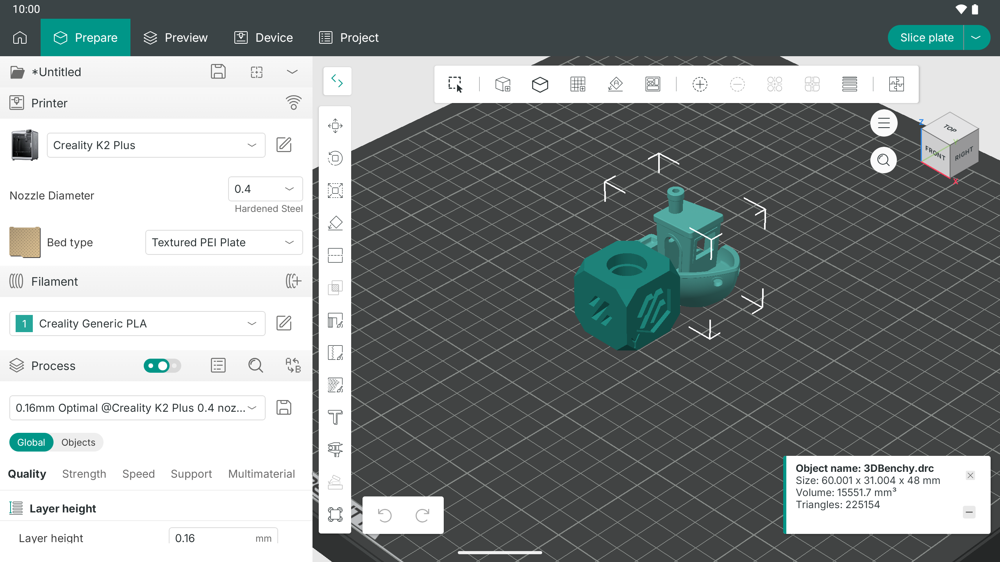
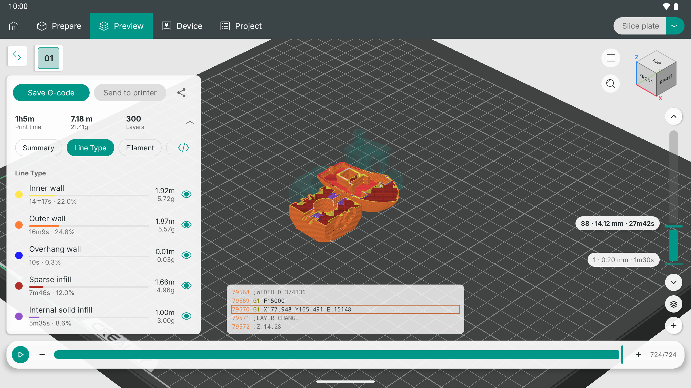
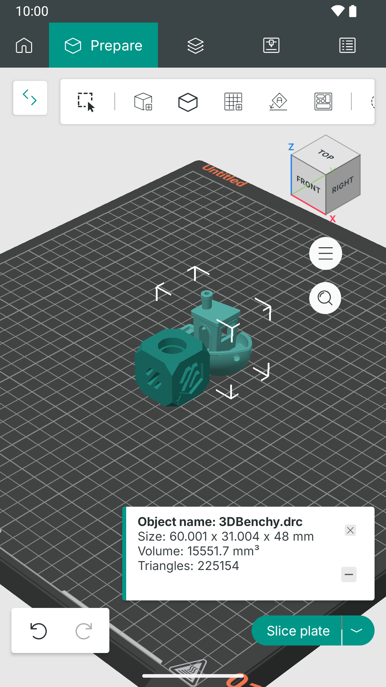
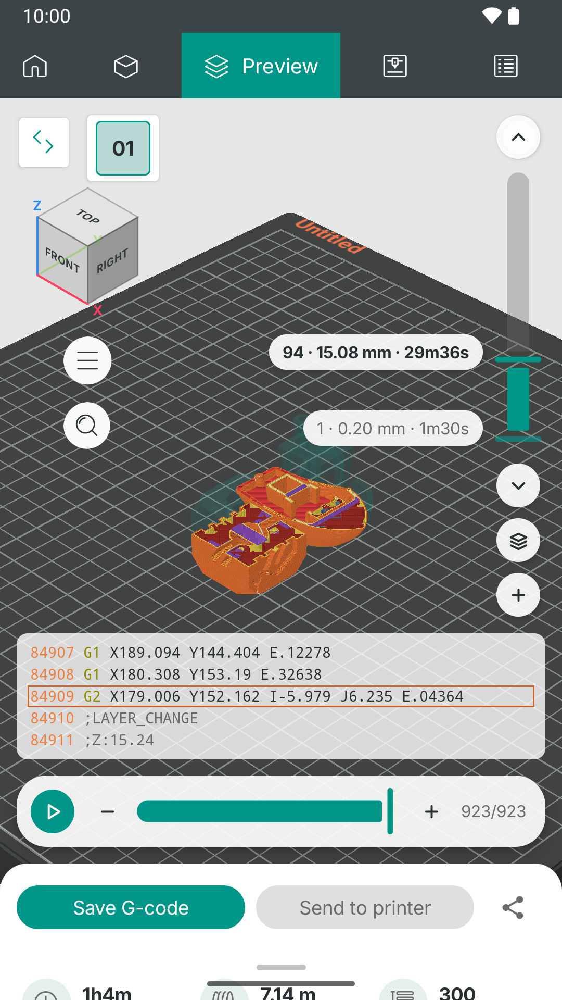
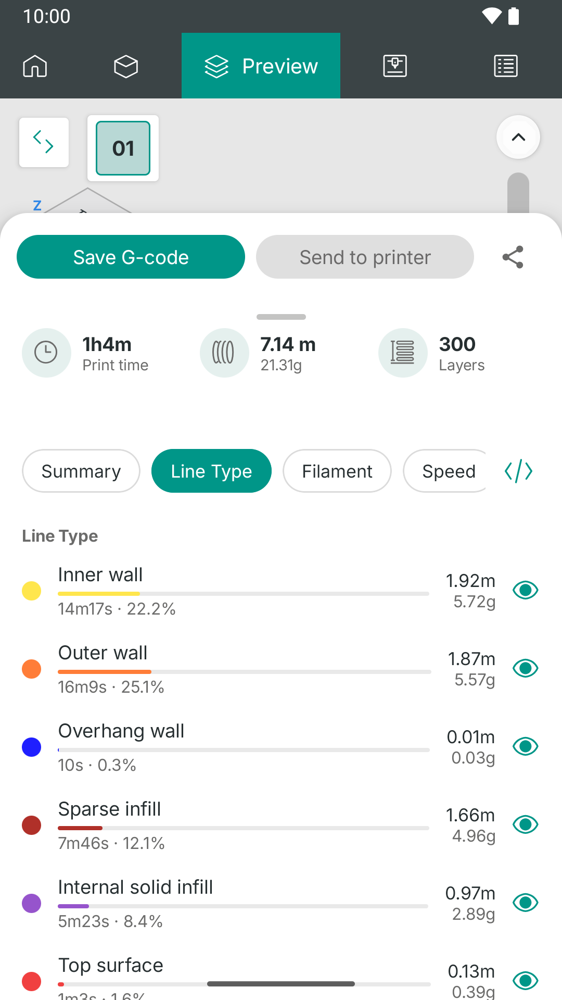
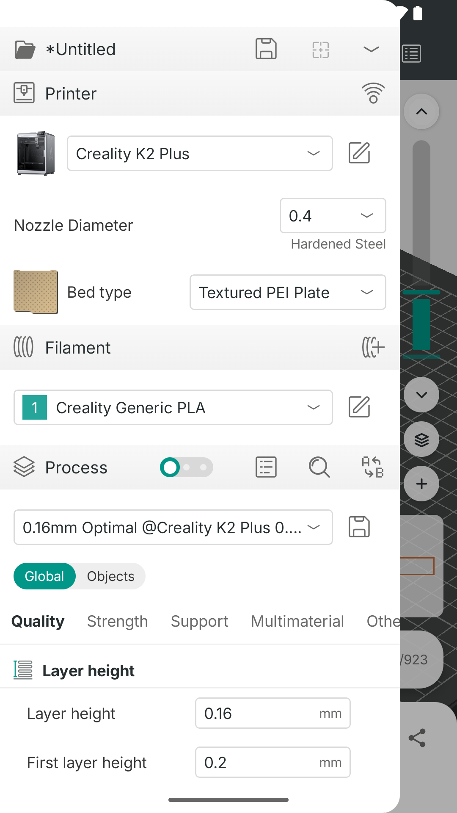
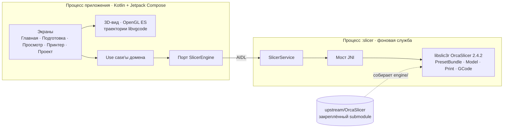

<div align="center">


### Полное ядро OrcaSlicer, которое работает прямо на Android.

Готовьте, нарезайте и отправляйте 3D-печать с телефона или планшета.<br>
Без компьютера, без облака и с тем же G-code, что у настольного OrcaSlicer.

[](LICENSE)
[](https://github.com/OrcaSlicer/OrcaSlicer/releases/tag/v2.4.2)


[English](README.md) · **Русский**

[Скриншоты](#скриншоты) · [Возможности](#возможности) · [Как устроено](#как-устроено) · [Проверка](#сверка-с-настольным-orcaslicer) · [Сборка](#сборка-из-исходников) · [Участие](#участие)

</div>

---

## О проекте

Orcinus — полноценный слайсер для 3D-печати на Android. Он не переписывает
слайсер заново и не отправляет модели на сервер. Он собирает под Android
**собственное C++-ядро OrcaSlicer** (`libslic3r`, его 17 зависимостей и
системные профили всех 66 производителей принтеров) и управляет им через
интерфейс, сделанный для пальцев.

Каждое решение при нарезке принимает код OrcaSlicer. Модель, нарезанная на
телефоне, даёт тот же G-code, что настольный OrcaSlicer 2.4.2 с теми же
профилями, и это проверяет автоматическое сравнение после каждого изменения
ядра.

> [!NOTE]
> **Статус: предварительная версия (0.1.0).** Порядок работы OrcaSlicer 2.4.2
> для FFF-печати перенесён и проверен на устройстве. В Google Play приложения
> пока нет — соберите его из исходников, как описано [ниже](#сборка-из-исходников).

## Скриншоты

<p align="center">
  
  
</p>
<p align="center">
  
  
  
  
</p>

## Возможности

### Подготовка
- **Рабочее пространство с несколькими столами** и 3D-видом OrcaSlicer:
  реалистичное освещение с тенями и затенением, куб видов, подписи объектов,
  подсветка нависаний и зазоры при печати по очереди.
- **Открывает почти всё:** STL, OBJ с цветами, проекты 3MF, STEP, AMF, SVG и
  архивы ZIP — из выбора файлов, через «Открыть с помощью» и «Поделиться» или
  перетаскиванием. Встроены «удобные» и тестовые модели OrcaSlicer.
- **Инструменты:** перемещение, поворот, масштаб, укладка на грань,
  автоориентация, расстановка и заполнение стола, разрез с соединителями,
  булевы операции, текст и SVG на модели, измерение, уши каймы, вид сборки,
  упрощение и починка сетки.
- **Рисование:** поддержки, шов, нечёткая поверхность и цвета для
  многоцветной печати.
- **Точная настройка объектов:** список с деталями, модификаторами,
  диапазонами высот и копиями; свои настройки у объекта и стола; переменная
  высота слоя; таблица параметров OrcaSlicer с главными настройками всех
  объектов сразу.

### Нарезка и просмотр
- **Нарезка в фоне** в отдельном процессе: ход и кнопка «Отмена» в
  уведомлении. Сбой внутри ядра не закрывает приложение.
- **Просмотр G-code** на собственном `libvgcode` из OrcaSlicer: ползунки слоёв
  и перемещений, 16 видов легенды (тип линии, скорость, расход, время слоя,
  температура, pressure advance и другие), окно G-code и положение сопла.
- **Понятные предупреждения:** предупреждения и ошибки нарезки OrcaSlicer, у
  каждой — «Перейти к» нужному объекту или настройке.
- **Результат:** сохранить G-code или нарезанный `.gcode.3mf`, выгрузить
  траектории в OBJ, поделиться через Android или открыть готовый `.gcode` и
  `.gcode.3mf`.

### Принтеры, материалы и настройки
- **Мастер настройки OrcaSlicer** с профилями всех 66 производителей и
  обновлением профилей по сети (можно выключить).
- **Полные вкладки настроек** принтера, материала и процесса: все страницы и
  параметры, с проверками OrcaSlicer, поиском, сравнением пресетов и
  вопросами перед тем, как отбросить или перенести изменения.
- **Многоцветная печать:** слоты материалов, объёмы промывки, башня очистки и
  рамминг.
- **Калибровка:** температура, поток, pressure advance, ретракт, максимальный
  расход, VFA, input shaping и прохождение углов.

### Печать
- **Отправка на 16 видов хостов принтеров:** OctoPrint/Klipper, Moonraker,
  PrusaLink, PrusaConnect, Duet, FlashAir, AstroBox, Repetier, MKS, ESP3D,
  CrealityPrint (с раскладкой материалов CFS), Flashforge, Elegoo Link, Obico,
  SimplyPrint и 3DPrinterOS.
- **Поиск принтеров** в локальной сети и очередь загрузок, которая работает,
  даже когда вы ушли с экрана.

### Везде
- **Полностью переведено на 22 языка OrcaSlicer**, светлая и тёмная темы.
- **Телефоны, планшеты и складные:** управление под пальцы на телефоне;
  раскладка настольного OrcaSlicer на планшете, с его горячими клавишами и
  управлением мышью; разделённый экран, окна любого размера, позы «книга» и
  «ноутбук» у складных.
- **Проекты:** автосохранение и восстановление после сбоя, недавние проекты и
  сведения о проекте как в OrcaSlicer.
- **Конфиденциальность:** нет учётных записей и рекламы. Сборки из Google Play
  отправляют в Firebase анонимную статистику использования и отчёты о сбоях;
  «Режим конфиденциальности» отключает их вместе со всеми сетевыми запросами, а
  сборки из исходников без настроек Firebase не отправляют ничего. Кроме этого,
  Orcinus выходит в сеть только за обновлениями профилей, к добавленным вами
  принтерам и для проверки сети, когда вы её запускаете. Подробно — в
  [политике конфиденциальности](docs/privacy-policy.md).

## Как устроено


```mermaid
flowchart LR
    subgraph app["Процесс приложения · Kotlin + Jetpack Compose"]
        direction TB
        ui["Экраны<br/>Главная · Подготовка · Просмотр · Принтер · Проект"]
        render["3D-вид · OpenGL ES<br/>траектории libvgcode"]
        domain["Use case'ы домена"]
        port["Порт SlicerEngine"]
        ui --> domain
        ui --> render
        domain --> port
    end
    subgraph slicer["Процесс :slicer · фоновая служба"]
        direction TB
        service["SlicerService"] --> jni["Мост JNI"]
        jni --> orca["libslic3r OrcaSlicer 2.4.2<br/>PresetBundle · Model · Print · GCode"]
    end
    port -- AIDL --> service
    upstream[("upstream/OrcaSlicer<br/>закреплённый submodule")] -. "собирает engine/" .-> orca
```

- **Исходники Orca не правятся.** OrcaSlicer подключён закреплённым Git
  submodule. Сборка `engine/` читает его списки исходников и рецепты
  зависимостей, поэтому обновить OrcaSlicer — значит сдвинуть submodule и
  пересобрать, а не переносить код. Единственная заплатка переводит
  `libvgcode` на OpenGL ES.
- **Точный перенос.** Поведение настольного приложения (окна, меню, проверки,
  крайние случаи) перенесено функция за функцией из кода интерфейса
  OrcaSlicer, и каждый перенос называет оригинал. Меняется только
  представление: под сенсорный экран.
- **Изолированное ядро.** `libslic3r` работает только в процессе `:slicer` за
  AIDL-службой: тяжёлая нарезка не тормозит интерфейс, а сбой ядра не
  закрывает приложение.
- **Чистая архитектура.** Экраны — независимые feature-модули поверх use
  case'ов домена; к ядру обращаются только через порт. Подробнее —
  [`docs/architecture.md`](docs/architecture.md).

<details>
<summary><b>Структура репозитория</b></summary>

| Путь | Что там |
| --- | --- |
| [`app/`](app) | Оболочка приложения: связывание зависимостей, навигация, служба `:slicer` |
| [`feature/`](feature) | Экраны: `home`, `prepare`, `preview`, `device`, `project`, `sidebar`, `settings`, `setup`, `preferences`, `objecttable`, `about` |
| [`core/`](core) | `model` (состояние на чистом Kotlin), `designsystem` (тема, иконки и компоненты OrcaSlicer на Compose), `ui` (общие окна и меню) |
| [`domain/`](domain) | Use case'ы: логика приложения, перенесённая из интерфейса OrcaSlicer |
| [`data/`](data) | Хранилище состояния стола и уведомления о лицензиях |
| [`render/`](render) | `scene`: 3D-вид; `gcode`: `libvgcode` из OrcaSlicer через JNI |
| [`slicing/`](slicing) | `api`: порт ядра; `service`: AIDL-служба; `native`: мост JNI и C++-адаптер над `libslic3r` |
| [`network/`](network) | Клиенты хостов принтеров и поиск принтеров |
| [`storage/`](storage) | Проекты, документы и файлы сцены в хранилище Android |
| [`engine/`](engine) | CMake-сборка OrcaSlicer и его зависимостей под Android arm64 |
| [`upstream/`](upstream) | OrcaSlicer, закреплённый в [`orca.lock.json`](upstream/orca.lock.json) |
| [`scripts/`](scripts) | Сборка ядра, тесты на устройстве, сравнение с desktop, лицензии |
| [`docs/`](docs) | Архитектура, контракт нарезки, рабочий план, политика конфиденциальности |
| [`store/`](store) | Страница в Google Play: тексты, значок, обложка, скриншоты телефона и планшетов, примечания к выпуску |

</details>

## Сверка с настольным OrcaSlicer

Каждую возможность мы оцениваем по одному из трёх уровней: **C** —
собирается; **R** — работает и проходит проверки на настоящем устройстве;
**G** — результат совпадает с настольным OrcaSlicer. Для ядра требуется G.

| Проверка | Последний результат на Pixel 8 Pro |
| --- | --- |
| Собственные тесты OrcaSlicer `fff_print_tests` | 37 из 37 тестовых случаев |
| Собственные тесты OrcaSlicer `libslic3r_tests` | 114 тестовых случаев, 48 537 проверок |
| Связка приложения и ядра (`orca_engine_adapter_tests`) | 154 тестовых случая, 5 296 проверок |
| G-code против официальной сборки OrcaSlicer 2.4.2 | 10 эталонных моделей: те же слои, материал — в пределах 0,03 %, время печати — ±2 с |

Сравнение скачивает официальный настольный релиз (с проверкой хеша), нарезает
одни и те же модели с теми же профилями на компьютере и на телефоне и
сравнивает G-code по перемещениям. Подробнее —
[`docs/golden-comparison.md`](docs/golden-comparison.md).

## Сборка из исходников

### Что понадобится

- Windows 10 или 11: скрипты сборки написаны на PowerShell, а сборка ядра
  сама скачивает MSYS2 для GMP и MPFR
- Android Studio, `JAVA_HOME` указывает на её встроенный JDK (`jbr`), и
  Android SDK с NDK **28.2.13676358**
- CMake 3.25+ и Ninja в `PATH`, Python 3
- Устройство arm64 с Android 10 или новее

### Сборка и установка

Один раз откройте проект в Android Studio — она сама запишет путь к SDK в
`local.properties`. Или создайте файл вручную со строкой
`sdk.dir=C:/путь/к/Android/Sdk`.

```powershell
git clone --recurse-submodules https://github.com/ArtLoz/-Orcinus.git
cd ./-Orcinus

# Зависимости OrcaSlicer под Android: один раз, около часа
powershell -NoProfile -ExecutionPolicy Bypass -File ./scripts/engine.ps1 -Stage deps

# Приложение; Gradle собирает библиотеку ядра вместе с libslic3r
./gradlew.bat :app:assembleDebug
adb install -r app/build/outputs/apk/debug/app-debug.apk
```

<details>
<summary><b>Тесты</b></summary>

```powershell
# Модульные тесты логики, интерфейса и сети
./gradlew.bat :domain:test :core:ui:testDebugUnitTest :feature:sidebar:testDebugUnitTest :network:printhost:test

# Тесты OrcaSlicer и связки с ядром на подключённом устройстве
powershell -NoProfile -ExecutionPolicy Bypass -File ./scripts/engine.ps1 -Stage all -Target libslic3r_tests,fff_print_tests,orca_engine_adapter_tests
powershell -NoProfile -ExecutionPolicy Bypass -File ./scripts/engine-test.ps1 -Suite fff_print_tests
powershell -NoProfile -ExecutionPolicy Bypass -File ./scripts/engine-test.ps1 -Suite orca_engine_adapter_tests

# Сравнение G-code с настольным OrcaSlicer
powershell -NoProfile -ExecutionPolicy Bypass -File ./scripts/engine.ps1 -Stage engine -Target orca_engine_slice
powershell -NoProfile -ExecutionPolicy Bypass -File ./scripts/golden.ps1
```

Подробнее — [`engine/README.md`](engine/README.md).
</details>

<details>
<summary><b>Обновление OrcaSlicer</b></summary>

```powershell
powershell -NoProfile -ExecutionPolicy Bypass -File ./scripts/update-orca.ps1 -Ref v2.4.3
powershell -NoProfile -ExecutionPolicy Bypass -File ./scripts/engine.ps1 -Stage all -Target libslic3r_tests,fff_print_tests,orca_engine_adapter_tests
./gradlew.bat :domain:test :app:assembleDebug
python scripts/notices/update_notices.py
```

Затем прогоните тесты на устройстве и сравнение с настольной версией. Правила —
в [`docs/upstream.md`](docs/upstream.md).
</details>

<details>
<summary><b>Релизная сборка</b></summary>

Релиз сжимается R8 и подписывается ключом, который хранится вне репозитория:
в `keystore.properties` или переменных `ORCINUS_*` (см.
[`app/build.gradle.kts`](app/build.gradle.kts)).

```powershell
./gradlew.bat :app:bundleRelease
```
</details>

## Что не входит

Часть возможностей OrcaSlicer зависит от закрытых сервисов или от компьютера и
не переносится: облако, монитор устройств, AMS и принтеры с двумя соплами
Bambu Lab (нужен закрытый сетевой модуль Bambu), учётные записи Orca Cloud и
скачивание моделей, настройки окон и мыши, ассоциации файлов, импорт USD, ABC
и PLY (в OrcaSlicer он есть только на macOS).

## Участие

Задачи и pull request'ы приветствуются, на русском или английском. Начните с
[`CONTRIBUTING.md`](CONTRIBUTING.md) и напишите в pull request'е, что
проверено на устройстве, а что только собирается.

## Лицензия

Orcinus — свободная программа под [GNU Affero General Public License v3.0](LICENSE),
лицензией OrcaSlicer, чьи ядро, профили и иконки входят в приложение.

У встроенных библиотек свои лицензии; страница «О программе» в приложении
показывает каждый компонент с полным текстом лицензии. Шрифт интерфейса —
[Inter](https://rsms.me/inter/) (SIL Open Font License 1.1).

## Благодарности

Orcinus опирается на [OrcaSlicer](https://github.com/OrcaSlicer/OrcaSlicer) от
SoftFever и участников, который основан на
[Bambu Studio](https://github.com/bambulab/BambuStudio) от Bambu Lab,
[PrusaSlicer](https://github.com/prusa3d/PrusaSlicer) от Prusa Research и
Slic3r Алессандро Ранеллуччи и сообщества RepRap.

<sub>Orcinus — независимый проект. Он не связан с разработчиками OrcaSlicer, Bambu Studio и PrusaSlicer и не одобрен ими.</sub>
